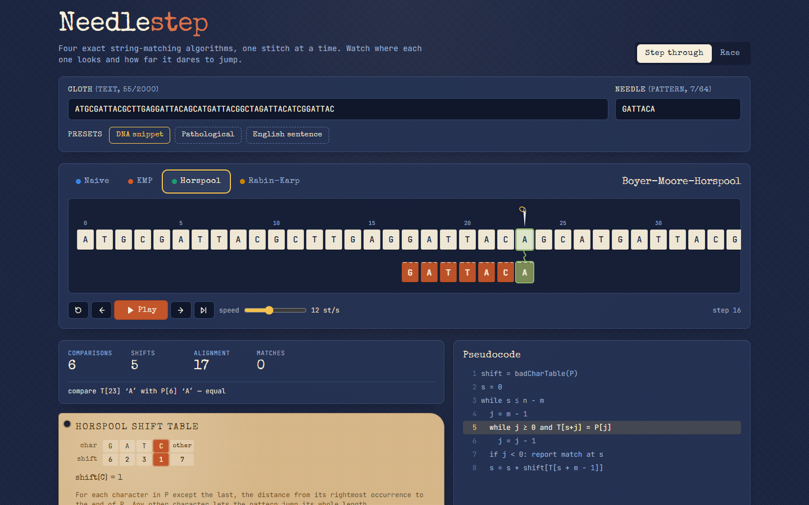

# Needlestep

Step through naive, KMP, Boyer-Moore-Horspool, and Rabin-Karp string matching
character by character, with shift tables and comparison counts side by side.



Try the **Pathological** preset (a thousand `A`s, needle `AAAB`), pick an
algorithm and press Play: naive re-reads the same cloth four times per cell,
Horspool checks only the last cell, and KMP never moves its text pointer
backwards. Then switch to **Race** and watch all four on the same cloth.

## Features

- **Loom view** — the text is a row of cream fabric swatches; the pattern is
  stitched beneath in rust and slides to the current alignment. A needle marks
  the character being read and a short thread joins the two cells being
  compared (gold while comparing, green on equal, rust on mismatch). Finished
  matches leave a green running stitch under the cloth.
- **Four matchers as step generators** — `naive`, `kmp`, `horspool` and
  `rabinKarp` yield typed `compare / mismatch / shift / match / hash` events
  with exact text and pattern indices. The UI just folds events into a view.
- **Tables you can watch being consulted** — the KMP failure table and the
  Horspool bad-character table sit on a kraft-paper tag; the entry that
  justified the last shift lights up in rust.
- **Rabin-Karp panel** — hash of the pattern, hash of the current window, the
  roll arithmetic that produced it, and a spurious-hit counter. Switch the
  modulus from 2³¹ − 1 to 101 to see spurious hits actually happen.
- **Race mode** — all four algorithms run in lockstep on the same input, one
  unit of work per tick. Each lane is a heat strip of the cloth that darkens
  every time that algorithm reads a cell; a bar chart tracks work done against
  each algorithm’s finish line, with live comparison / shift / match counters.
- **Presets** — DNA snippet, pathological repeated text, English sentence.
- **Pseudocode panel** highlighting the line for the current step.
- Keyboard: `space` play/pause, `→` step, `←` step back, `R` reset, `E` run to
  end. Responsive down to ~380 px.

## How it works

Every matcher in `src/core/` is a generator over `(text, pattern)`. Instead of
returning match positions, it yields one event per observable action, so the
same code powers unit tests (`runToEnd` drains a generator and totals the
events), the step-through view (events are materialised lazily; stepping back
is a replay) and the race (each lane pulls events until it has spent one
comparison or hash check). A shift event carries the *reason* for the shift
when a table was consulted:

```
compare  { shift: 4, i: 10, j: 6, equal: false }
mismatch { shift: 4, i: 10, j: 6 }
shift    { from: 4, to: 5, by: 1, lookup: { table: 'badChar', key: 'C', value: 1 } }
```

**KMP** precomputes the prefix function `fail[j]`: the length of the longest
proper prefix of `P[0..j]` that is also its suffix. On a mismatch at `j` the
pattern index falls back to `fail[j−1]` while the text index stays put, which
the loom shows as the pattern sliding right by `j − fail[j−1]` with its first
`fail[j−1]` cells already marked as matched. For `ABABCABAB` the table is
`[0,0,1,2,0,1,2,3,4]`, and the search never does more than `2n` comparisons.

**Horspool** compares right to left and, whatever happened, shifts by the
table entry of the text character under the pattern's *last* cell. The table
holds, for each character in `P[0..m−1)`, the distance from its rightmost
occurrence to the end; anything else gets `m`. For `EXAMPLE` that is
`E→6, X→5, A→4, M→3, P→2, L→1, other→7`, so on a text full of characters that
are not in the needle the pattern leaps its whole length per comparison.

**Rabin-Karp** treats each length-`m` window as a base-257 number modulo the
Mersenne prime 2³¹ − 1. Sliding the window one cell right is O(1):
`h' = ((h − code(out) · 257^(m−1)) · 257 + code(in)) mod p`, with `257^(m−1)`
precomputed. All intermediate products stay under 2⁴⁷, so plain doubles are
exact. Characters are only compared when the hashes agree; a hash agreement
that fails verification is reported as a spurious hit.

## Run

```sh
npm install
npm run dev        # local dev server
npm run build      # type-check + production build to dist/
npm test           # vitest: matchers, tables, rolling hash, view reducer
```

## Tech

Vite 8 · React 19 · TypeScript (strict) · Tailwind CSS 4 · Vitest 5 ·
Special Elite and JetBrains Mono via @fontsource. No runtime dependencies
beyond React; the algorithms are implemented from scratch in `src/core/`.

## License

MIT © 2026 Jafn
